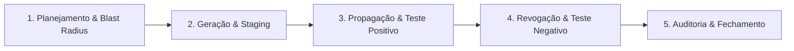

# Política Global de Rotação de Segredos (Secret Rotation Policy)

**Projeto:** Birth Hub 360°  
**Propriedade:** Agente 15 (Segurança Aplicada e Rotação de Segredos)  
**Status:** Vigente e Normativo  
**Última Atualização:** 2026-10-08  

---

## 1. Princípios Fundamentais (Regras de Ouro)

1. **Chave substituída não é chave rotacionada:** A rotação só é considerada concluída quando comprovado documental e empiricamente que a **credencial antiga foi invalidada** e não autentica mais (rejeição com `401 Unauthorized` ou `403 Forbidden`).
2. **Zero segredo em texto claro:** Credenciais nunca devem ser trafegadas, commitadas, impressas em logs, fixtures, screenshots, relatórios ou tickets.
3. **Fail-Closed por design:** A ausência de variável de ambiente ou chave em produção nunca deve recorrer a fallbacks permissivos em texto claro; deve recusar a inicialização ou responder com `503 Service Unavailable`.
4. **Isolamento de Impacto (Blast Radius):** Toda rotação deve prever a estratégia de execução adequada (Dual-Key transparente, Re-encriptação em lote, ou Janela de Manutenção programada com comunicação prévia aos usuários).

---

## 2. Catálogo e Taxonomia de Segredos

| Tier | Categoria | Variáveis / Segredos | Algoritmo / Mecanismo | Impacto de Rotação | Tipo de Rotação | Cadência Padrão |
| :--- | :--- | :--- | :--- | :--- | :--- | :--- |
| **Tier 0** | **Criptografia em Repouso & PII** | `CREDENTIALS_ENCRYPTION_KEY`, `PII_BLIND_INDEX_KEY` | AES-256-GCM / HMAC-SHA256 | Crítico (invalida tokens no DB ou índices de busca) | Re-encriptação / Re-indexação em lote | 180 dias ou Incidente |
| **Tier 1** | **Identidade & Plataforma** | `BETTER_AUTH_SECRET`, `PLATFORM_OPERATOR_TOKEN`, `DATABASE_URL`, `REDIS_URL` | HMAC-SHA256 / Bearer Token / URI TLS | Alto (invalida sessões ativas ou conexões de infraestrutura) | Janela de Manutenção ou Graceful Reload | 90 dias ou Incidente |
| **Tier 2** | **Webhooks Receptores (Entrada)** | `BIRTH_VOICES_WEBHOOK_SECRET`, `BIRTHHUB360_WEBHOOK_SECRET`, `THREECX_WEBHOOK_SECRET`, `CHATWOOT_WEBHOOK_SECRET`, `EMAIL_INBOUND_WEBHOOK_SECRET`, `SIGNATURE_INBOUND_WEBHOOK_SECRET` | HMAC-SHA256 (`timingSafeEqual`) | Médio (rejeição de payloads externos em trânsito) | Bilateral Coordenada | 90 dias ou Incidente |
| **Tier 3** | **Provedores Externos (Saída)** | `BITRIX24_WEBHOOK_URL`, `BLAND_API_KEY`, `GOOGLE_CLIENT_SECRET`, `MICROSOFT_CLIENT_SECRET`, `GROQ_API_KEY`, `OPENAI_API_KEY`, `TAVILY_API_KEY`, `SERPER_API_KEY`, `APOLLO_API_KEY`, `HUNTER_API_KEY`, `SMTP_PASS` | API Key / OAuth 2.0 / Token em URL | Baixo-Médio (falha de comunicação com provedor) | Painel do Provedor + Sync Infisical | 90–180 dias ou Incidente |
| **Tier 4** | **Subssistemas Locais / Self-Hosted** | `STORAGE_SECRET_ACCESS_KEY`, `N8N_ENCRYPTION_KEY`, `SUPERSET_SECRET_KEY`, `CASDOOR_CLIENT_SECRET`, `LIVEKIT_API_SECRET` | S3 Auth / Chave Simétrica | Baixo (serviços desacoplados) | Atualização de Compose / Config | 180 dias ou Incidente |

---

## 3. O Ciclo de Vida Padrão de Rotação (5 Fases)

Todo processo de rotação formal deve percorrer rigorosamente as cinco fases:



### Fase 1: Planejamento & Avaliação de Blast Radius
- Identificar dependências e consumers da chave.
- Determinar se há necessidade de re-encriptação de dados em repouso (`reencrypt-credentials.ts`) ou recálculo de índices (`backfill-contact-pii.ts`).
- Agendar janela de manutenção caso envolva `BETTER_AUTH_SECRET` (invalidação de sessões de usuários).

### Fase 2: Geração & Staging
- Gerar o novo segredo utilizando geradores criptograficamente seguros (CSPRNG):
  ```bash
  # Chaves de 256 bits em base64 (ex: CREDENTIALS_ENCRYPTION_KEY, PII_BLIND_INDEX_KEY)
  openssl rand -base64 32

  # Tokens hexadecimais (ex: PLATFORM_OPERATOR_TOKEN)
  openssl rand -hex 32
  ```
- Cadastrar no cofre central (Infisical / Render Secrets) sem apagar a chave anterior imediatamente caso o sistema suporte dual-key fallback.

### Fase 3: Propagação & Validação Positiva
- Propagar a credencial para o ambiente de destino (Staging primeiro, depois Produção).
- Reiniciar/redeploy da aplicação.
- Executar teste funcional positivo (chamada de API ou serviço com a nova chave). Confirmar retorno HTTP `200 OK`.

### Fase 4: Revogação & Comprovação de Invalidação Negativa
- Revogar a credencial antiga no provedor externo (ex.: console Google, portal Bland AI, painel Bitrix24).
- **Teste Negativo Mandatório:** Executar chamada explícita utilizando a credencial antiga. Comprovar recebimento de erro de autenticação (`401` ou `403`).
- Se a credencial antiga ainda responder com sucesso, o procedimento está **incompleto**.

### Fase 5: Registro de Auditoria & Fechamento
- Registrar o evento em `AuditLog` ou relatório de incidente (se aplicável).
- Caso o segredo tenha sido exposto em histórico git, atualizar `.gitleaksignore` com o fingerprint e data de revogação.
- Atualizar o status do runbook correspondente.

---

## 4. Runbooks Operacionais Oficiais

Os procedimentos detalhados e comandos de validação para cada componente encontram-se em `docs/security/runbooks/`:

1. [`ROTATE_CREDENTIALS_ENCRYPTION_KEY.md`](file:///c:/Github/Birthub-360/docs/security/runbooks/ROTATE_CREDENTIALS_ENCRYPTION_KEY.md) — Rotação da chave mestra AES-256-GCM com re-encriptação de banco via `reencrypt-credentials.ts`.
2. [`ROTATE_PII_BLIND_INDEX_KEY.md`](file:///c:/Github/Birthub-360/docs/security/runbooks/ROTATE_PII_BLIND_INDEX_KEY.md) — Rotação do HMAC de busca cega de PII e re-indexação de contatos via `backfill-contact-pii.ts`.
3. [`ROTATE_BETTER_AUTH_SECRET.md`](file:///c:/Github/Birthub-360/docs/security/runbooks/ROTATE_BETTER_AUTH_SECRET.md) — Rotação do segredo de sessões e cookies com governança de sessões ativas.
4. [`ROTATE_PLATFORM_OPERATOR_TOKEN.md`](file:///c:/Github/Birthub-360/docs/security/runbooks/ROTATE_PLATFORM_OPERATOR_TOKEN.md) — Rotação do token de operador de infraestrutura (`/admin/queues`, `/metrics`).
5. [`ROTATE_INBOUND_WEBHOOK_SECRETS.md`](file:///c:/Github/Birthub-360/docs/security/runbooks/ROTATE_INBOUND_WEBHOOK_SECRETS.md) — Rotação bilateral de webhooks receptores (Birth Voices, 3CX, Chatwoot, Voice Result).
6. [`ROTATE_BITRIX24_WEBHOOKS.md`](file:///c:/Github/Birthub-360/docs/security/runbooks/ROTATE_BITRIX24_WEBHOOKS.md) — Procedimento para portais Bitrix24 onde o token compõe a URL.
7. [`ROTATE_BLAND_AI_KEY.md`](file:///c:/Github/Birthub-360/docs/security/runbooks/ROTATE_BLAND_AI_KEY.md) — Rotação de chave externa da Bland AI (disparo de telefonia).
8. [`ROTATE_GEMINI_API_KEY.md`](file:///c:/Github/Birthub-360/docs/security/runbooks/ROTATE_GEMINI_API_KEY.md) — Revogação de chave do Google AI Studio exposta em histórico.
9. [`TEMPLATE_SECRET_ROTATION.md`](file:///c:/Github/Birthub-360/docs/security/runbooks/TEMPLATE_SECRET_ROTATION.md) — Gabarito padronizado para elaboração de novos runbooks de rotação.

---

## 5. Ferramentas Automatizadas de Suporte

O repositório fornece utilitários executáveis em `scripts/security/`:
- `scripts/security/reencrypt-credentials.ts`: Re-encriptação em lote de registros protegidos no banco de dados com suporte a `--dry-run`.
- `scripts/security/backfill-contact-pii.ts`: Recálculo e população de índices cegos de PII por tenant.
- `scripts/security/audit-secret-hygiene.ts`: Diagnóstico de conformidade de variáveis de ambiente, detecção de placeholders e verificação de entropia sem exibição de segredos.
- `scripts/security/scan-secrets.sh`: Varredura local pré-commit com Gitleaks ou motor regex de alto sinal.
